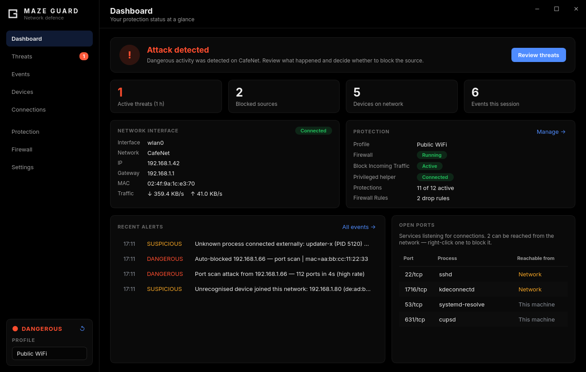
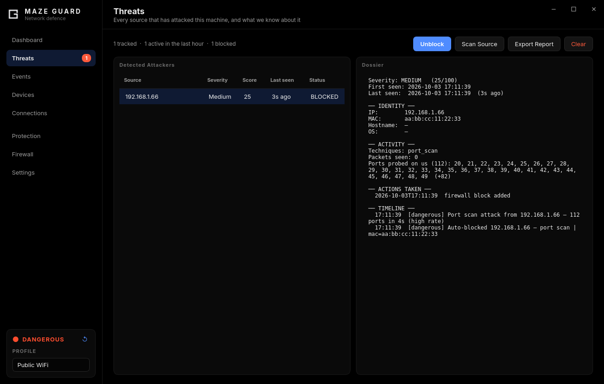
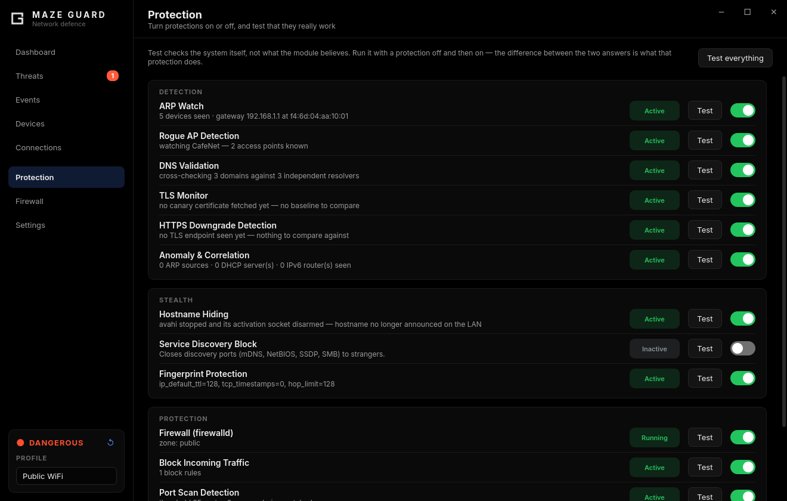
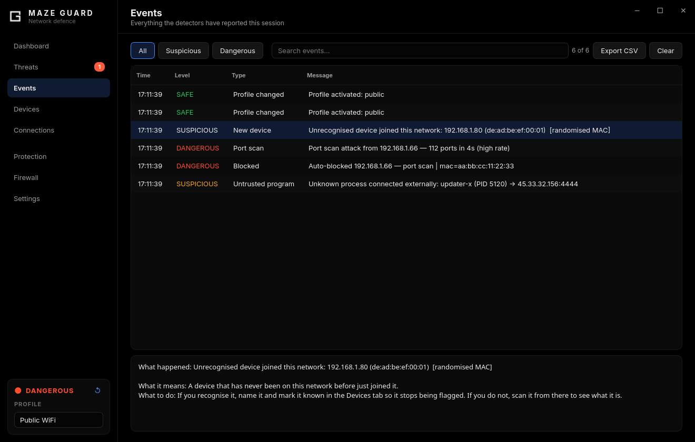
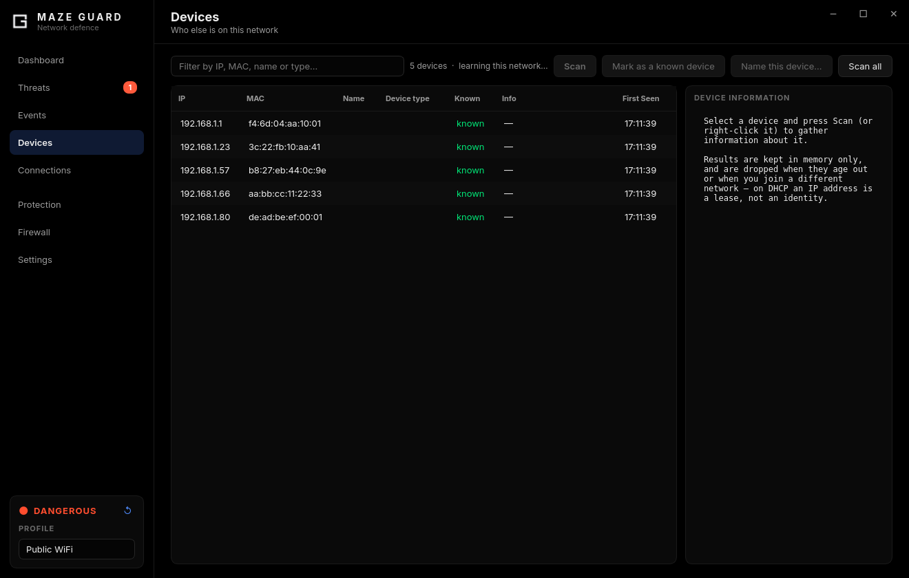
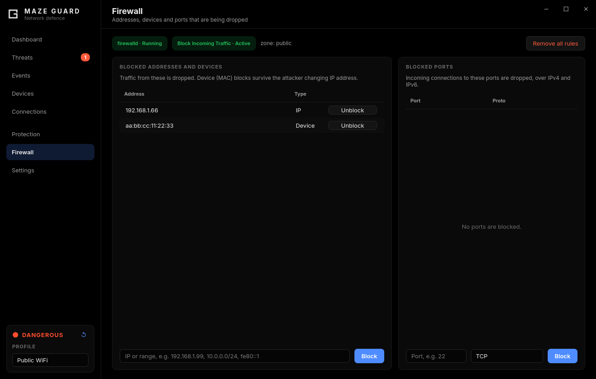
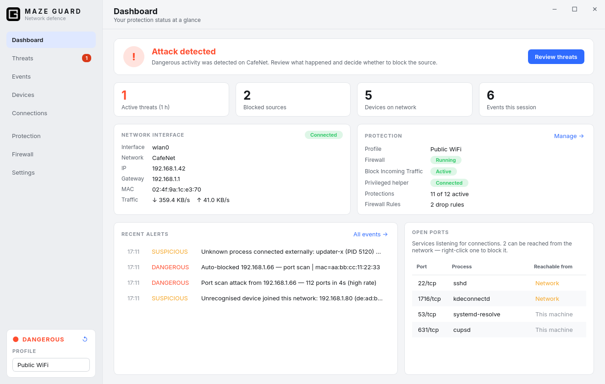

<div align="center">


# MAZE GUARD

**Public WiFi Security Monitor**

*Developed for [Maze Linux](https://github.com/berk-kucuk/MazeLinux)*

*MITM detection · firewalld integration · Packet analysis*

---



<table>
  <tr>
    <td align="center"><br><sub><b>Threats</b> — one dossier per attacker</sub></td>
    <td align="center"><br><sub><b>Protection</b> — switches with live self-tests</sub></td>
  </tr>
  <tr>
    <td align="center"><br><sub><b>Events</b> — every detection, explained</sub></td>
    <td align="center"><br><sub><b>Devices</b> — who else is on this network</sub></td>
  </tr>
  <tr>
    <td align="center"><br><sub><b>Firewall</b> — address, device and port blocks</sub></td>
    <td align="center"><br><sub>Light theme</sub></td>
  </tr>
</table>

<sub>Screenshots use invented example data.</sub>

---

[](https://python.org)
[](https://pypi.org/project/PyQt6/)
[](https://kernel.org)
[](LICENSE)

</div>

---

## What is Maze Guard?

Maze Guard is a Linux desktop application that monitors your network in real time and alerts you to threats commonly found on public WiFi networks — coffee shops, airports, hotels. It detects active attacks (ARP spoofing, port scans, Evil Twin APs, DNS poisoning), manages firewall rules through firewalld, and gives you one-click tools to block IPs and ports without breaking your internet connection.

The GUI runs as your normal user. A small privileged helper runs as a **systemd daemon** (root) that handles packet capture and firewall rules. Because the daemon is started by systemd, the GUI never needs your password — credential handling is removed entirely, which closes off the password-prompt privilege-escalation surface.


### What it does not cover

Maze Guard watches **the network you are connected to**. Within that scope it is
thorough, and it names the source: every hostile device gets a dossier with its
MAC, vendor, hostname, guessed OS, everything it was seen doing, and what Maze
Guard did about it. If someone attacks you on a cafe or hotel network, you will
know which device it was.

It is not a whole-system security suite, and these attacks look normal to it:

| Not covered | Why | What does cover it |
|---|---|---|
| Phishing — you typed your password into a fake site | Ordinary HTTPS to a real server | Browser warnings, a password manager that refuses to autofill on the wrong domain |
| Malware already running on your machine | Maze Guard sees processes holding sockets, not what they do | Qlam (ClamAV), firejail sandboxing |
| A breach at a service you use | Nothing on your machine is involved | Unique passwords, 2FA, breach notifications |
| Someone with physical access to a powered-off machine | Not a network event | LUKS encryption, Secure Boot |

Knowing the edge of the sensor is part of trusting it. A tool that claims to
catch everything teaches you to stop checking.

---

## Features

### Detection & Monitoring
| Module | What it detects |
|---|---|
| **ARP Watcher** | ARP spoofing, gateway MAC/IP changes |
| **Port Scan Detector** | SYN sweeps by distinct-port breadth, plus FIN/NULL/XMAS stealth probes, with per-source evidence (ports, rate, duration) |
| **Anomaly & Correlation** | ARP host-discovery storms, ICMP ping sweeps and recon probes, rogue DHCP servers, one MAC claiming many IPs — and joins separate detections from one source into a single attack chain |
| **DNS Validator** | DNS poisoning (cross-checks 3 DoH resolvers) |
| **DNS Leak Preventer** | Plaintext DNS queries escaping the VPN tunnel, or going to a resolver you never configured — judged live, as each query leaves |
| **TLS Monitor** | Certificate hash changes for canary hosts |
| **HTTPS Downgrade Detector** | Plaintext HTTP to a host that served us TLS earlier and whose 443 has since stopped answering |
| **Rogue AP Detector** | Evil Twin APs (new BSSID for the current SSID, read via `iw`, `iwgetid` or `nmcli`), and ICMP-redirect exposure — the latter on wired links too |
| **Process Monitor** | Unknown processes making external connections |
| **IPv6 Router Watch** | Forged Router Advertisements — the IPv6 MITM: no lease, no race, the attacker simply announces itself as your router and your system configures itself from it |
| **Device Inventory** | A device that has never been on *this* network before joining it — keyed by MAC and scoped per network (SSID / gateway MAC), so a DHCP renewal is not a stranger and a stranger is not a renewal |

### Protection
| Feature | Description |
|---|---|
| **Firewall Control** | Start/stop firewalld itself, and toggle the inbound-DROP shield, from the Protection tab — with live state read back from the firewall, not remembered in the UI |
| **firewalld Integration** | Rich rules on the *actual* default zone (IPv4 and IPv6), each carrying a rate-limited kernel log line so every block is auditable |
| **Hostname Hiding** | Stops the mDNS responder (avahi) *and disarms its systemd activation socket*, so a local `.local` lookup cannot silently restart it |
| **TCP Fingerprint** | Normalises the IPv4 TTL and IPv6 hop limit, and removes TCP timestamps (uptime leak); originals are recorded on disk so a crash cannot lose them |
| **Service Blocker** | Drops inbound mDNS, LLMNR, NetBIOS, SMB, SSDP and WS-Discovery (IPv4 and IPv6) so the machine stops answering discovery probes |
| **Hardware Blocking** | Blocking a source also drops its MAC address. An IP is a DHCP lease — a host that renews it walks around an address block; the MAC is the device, and one rule covers its IPv4 and IPv6 addresses at once |
| **Post-block Evidence** | Every rule logs what it swallows, and those kernel log lines are read back into the dossier: how many packets the block ate, which ports were tried, when the last attempt was. Whether an attacker gave up or kept working at it for an hour is the part that says what they were |

### Interface
A sidebar window with an OLED-black dark theme (default) and a light theme, English (default) and Turkish. `Ctrl+1` … `Ctrl+8` switch pages, `Ctrl+F` searches the page on screen, and the tray menu switches profile without opening the window.

- **Dashboard** — One sentence that says whether anything needs you (*You are protected* / *Attack detected* / *Limited mode* / *Firewall stopped* / *Helper out of date*) with the button that deals with it; clickable counters for active threats, blocked sources, devices and events; network and protection summaries; recent alerts; and the services listening on this machine, split into *this machine only* and *reachable from the network* — right-click one to block its port
- **Threats** — One dossier per attacking source: severity score, identity (MAC, vendor, hostname, OS), techniques used, ports they probed, what they are running, full timeline. Block / Unblock, Scan Source and Export Report, also from the right-click menu. Double-clicking an event opens its source here
- **Events** — Filterable event log (All / Suspicious / Dangerous), text search, CSV export. Selecting an event explains it in two sentences: what the observation actually means, and the next thing worth doing — a detection nobody can act on has done half a job
- **Devices** — Every device on this network, and whether it belongs here. The inventory is keyed by **MAC** and scoped **per network**, so it survives DHCP: name a device once and it stays named; mark it known and it stops being flagged. Anything that has never been on this network before raises an alert — after a short learning window on a network you have not visited, so joining a café does not alert on forty strangers at once. **Scan**, **Mark as known**, **Name** and **Scan all** sit above the list; scans run at three depths (**Quick** ~25 ports, **Standard** ~100 with banners and TLS, **Thorough** ports 1-1024) with live progress. Each dossier names the thing: MAC vendor, NetBIOS/mDNS/UPnP name, manufacturer and model, device type, OS, open ports with service banners, TLS certificate identity, latency and a risk score with plain-language findings — exportable as a Markdown report. Results are held in memory only and expire after 15 minutes, when a different MAC appears behind that IP, or when you join another network
- **Connections** — Which program is talking to whom right now: process, remote address, service name, and whether the program is on your trusted list. Filter, or show only untrusted programs
- **Protection** — A switch for every module with a one-line description of what it protects against, a **Test** button beside each one, plus **Test everything**. A test asks the *system* — systemd, firewalld, the kernel, a live socket — or pushes a synthetic attack through the real analysis path, and reports what is true right now. Run it with a protection off and then on: the difference between the two answers is what that protection does. A module that refuses to start says why, on the spot
- **Firewall** — firewalld and inbound-shield status, blocked addresses and devices (IP, range or MAC) and blocked ports (IPv4 and IPv6), each removable in one click
- **Settings** — Appearance, alert and auto-block behaviour, custom profiles (create / edit / delete), switching profile by network, ignored addresses (IPv4/IPv6, CIDR), trusted programs, autostart, and the version and helper status
- **First run** — Four questions on a fresh install: which interface to watch, whether this network is trusted, whether to block attackers automatically, whether to start at login. Never shown to an existing install, and never blocks a launch

### Other
- **IP Reconnaissance** — Auto-triggered on confirmed attacks (and on demand): reverse DNS, NetBIOS, mDNS and UPnP names, MAC vendor, manufacturer/model, a port sweep with service banners, TLS certificate identity, HTTP server and page title, OS fingerprint, latency (ICMP, falling back to TCP handshake timing when ping is filtered), and a risk score with plain-language findings ("port 4444 open — Metasploit default handler port"). Only ever runs against on-link private addresses, never a spoofable public source. A confirmed attacker is **blocked before** the sweep starts, not after it
- **Incident Records** — Every hostile source is filed to `~/.local/share/maze-guard/`: an append-only evidence journal plus a dossier snapshot that survives restarts, exportable as a Markdown incident report
- **Custom Profiles** — Create, edit and delete named security profiles with per-feature toggles (Settings → Custom profiles); the selection survives a restart
- **Persistent Log** — All events written to `~/.config/maze/maze.log` (rotating, 2 MB × 3)
- **System Tray** — Starts hidden in the tray on login (autostart); click the tray icon to show the window; desktop notifications for dangerous events
- **Session Summary** — Event count breakdown shown on quit
- **IPv6** — Detection is not IPv4-only: v6 TCP scans are counted the same way, our own v6 addresses are recognised as ours, reconnaissance works against v6 targets, and a block applies to both families at once when the hardware address is known
- **English + Turkish** UI with live language switching, verified by tests that fail if the two tables drift or an interface string is missing

---

## Architecture

```
┌──────────────────────────────────────────────┐
│  GUI Process  (normal user, no password)     │
│                                              │
│  PyQt6 + qasync  ──►  MazeEngine            │
│                           │                  │
│                    HelperClient              │
│                           │  Unix socket     │
└───────────────────────────┼──────────────────┘
              /run/maze/maze.sock (root:maze 0660)
┌───────────────────────────┼──────────────────┐
│  Helper Daemon (root, maze-guard.service)    │
│                           ▼                  │
│   scapy (ARP/TCP/ICMP/DHCP) ───► push events│
│   firewalld (firewall rules)                  │
│   sysctl (TCP fingerprint)                   │
└──────────────────────────────────────────────┘
```

The helper runs as a systemd service and publishes a Unix socket at `/run/maze/maze.sock`, owned `root:maze` with mode `0660`. Only members of the `maze` group can reach it — enforced both by file permissions and an in-process `SO_PEERCRED` group-membership check. A `firewall-cmd` request must match one of the few exact invocation shapes Maze Guard sends (a query, a reload, setting the zone target to `DROP`/`default`, or adding/removing one validated rich rule, optionally with `--permanent` and a known zone). Anything else is rejected before reaching a subprocess call.

Rich rules are matched **in full** against fixed patterns rather than by prefix, so a legal-looking `source address=` clause cannot be extended with an `accept`, `masquerade` or `forward-port` action. The action is pinned to `drop`, catch-all sources (`0.0.0.0/0`, `::/0`) are refused so the channel cannot be used to black-hole the host, and the optional log clause is pinned to a `MAZE-` prefix at a capped rate. Service control is a separate command limited to the single unit `firewalld`, and every call is logged by the daemon.

---

## Requirements

- **OS:** Arch Linux or an Arch-based distribution (installed as a pacman package)
- **Python:** 3.11 or newer
- **System tools:** `firewalld`, `iproute2`, `dbus`, `polkit`, `systemd`
- **Optional:** one of `iw`, `networkmanager` (nmcli) or `wireless_tools` (iwgetid) to read the current access point for rogue-AP detection
- **Build only:** `imagemagick` (icon sizes)

---

## Installation

### From the Maze repository

**On Maze Linux** the repository is already configured:

```bash
sudo pacman -S maze-guard
```

**On Arch Linux and Arch-based distributions**, add the repository once:

1. Import and trust the Maze signing key:

   ```bash
   curl -O https://mazerepo.berkkucukk.com.tr/packages/mazelinux.gpg
   gpg --show-keys --with-fingerprint mazelinux.gpg
   sudo pacman-key --add mazelinux.gpg
   sudo pacman-key --lsign-key 7C4D515A6B930CB04794CEF6147C8159B3E2EE5F
   ```

   The fingerprint `gpg` prints must be `7C4D 515A 6B93 0CB0 4794  CEF6 147C 8159 B3E2 EE5F`.

2. Add the repository to the end of `/etc/pacman.conf`:

   ```ini
   [mazelinux]
   SigLevel = Required DatabaseOptional
   Server = https://mazerepo.berkkucukk.com.tr/packages
   ```

3. Sync and install:

   ```bash
   sudo pacman -Syu maze-guard
   ```

Optionally install `mazelinux-keyring` as well; it keeps the signing key up to date through pacman.

Remove with `sudo pacman -Rns maze-guard`.

Then launch it from your application menu or run `maze-guard`.

### Build from source

The package is built from this working tree by `build-pkg.sh` and installed with pacman, exactly like the published one:

```bash
sudo pacman -S --needed base-devel git
git clone https://github.com/berk-kucuk/maze-guard.git
cd maze-guard
sudo pacman -S --needed $(bash -c 'source packaging/PKGBUILD; echo "${depends[@]}" "${makedepends[@]}"')
./build-pkg.sh --install
```

Without `--install` the package is only built, into `dist-pkg/`.

`maze-python` (the shared Python runtime) comes from the Maze repository, so add the repository first (steps 1–2 above).

### Development

Run straight from a checkout in a virtual environment:

```bash
python3 -m venv venv
source venv/bin/activate
pip install -r requirements.txt

python main.py
```

---

## First Launch

Maze Guard **never asks for a password to run or to add protection**; it asks (via polkit) only before protection is lowered — stopping the firewall, lowering the inbound shield, removing a block — or before blocking a whole range or your own gateway/DNS. The package registers the privileged helper as a systemd service (`maze-guard.service`) that starts at boot, and the GUI simply connects to it over `/run/maze/maze.sock`.

A `maze` group gates access to that socket, and your user is added to it during install. **Log out and back in once** (or run `newgrp maze`) so your desktop session picks up the new group membership — until then the GUI runs in limited (detection-only) mode.

The GUI always runs as your normal user; only the helper runs as root. If the daemon is not running for any reason, the GUI degrades gracefully to limited mode instead of prompting.

### Running from a source checkout

If you cloned the repo and want the daemon without a full `/opt` install. The script copies the helper to a root-owned directory (`/usr/local/lib/maze-guard-dev`) and installs the same sandboxed `maze-guard.service` and polkit policy the package uses — root never runs code from your user-writable checkout. Re-run it after changing the helper; it refuses to run while the `maze-guard` package is installed:

```bash
sudo ./scripts/setup-daemon.sh        # install/update + enable maze-guard.service, add you to 'maze'
# ... and to remove it:
sudo ./scripts/setup-daemon.sh --uninstall
```

---

## Usage

### Checking that everything works

```bash
maze-guard --doctor
```

Exercises every feature against this machine — external tools, the privileged
helper and whether it is up to date, firewalld and the inbound shield, the
polkit action and whether an agent can show its prompt, each detection module's
start/stop, all three DoH resolvers, the TLS canaries and a
live recon probe — and prints PASS/WARN/FAIL with the fix for anything broken.
Exit status is non-zero if any check failed, so it can gate a deployment.

The check exists because the failure that matters for a security tool is not a
crash, it is a module that reports *Active* while silently doing nothing.

### Developing

```bash
./scripts/check.sh
```

Runs everything that has to be true before a release: every module compiles,
the full test suite, the three version numbers agree, no debug statements
survived, and the privileged helper still accepts nothing but `drop` rules.
`--quick` skips the end-to-end test; `--package` builds the Arch package after
the checks pass.

The suite includes an **end-to-end detection test** that needs no root: it opens
an unprivileged user + network namespace, makes real TCP connections to closed
ports on a private loopback, and asserts that the shipping capture path,
classifier and event bus produce the alert. That is the test that used to be a
phone running nmap and a person watching the screen.

```bash
QT_QPA_PLATFORM=offscreen ./venv/bin/python -m unittest discover -s tests -v
```

Besides the per-module tests, the suite drives the **real window** offscreen around a real engine, with the real privileged-helper code running in-process against a simulated firewalld (`tests/support/fake_firewalld.py`): every page, button and protection switch is exercised end to end, and every rule the GUI produces has to pass the same validation the root daemon applies (`tests/test_gui.py`, `tests/test_modules_e2e.py`, `tests/test_helper_security.py`).

### Profiles

Select a security profile in the sidebar (or from the tray menu). Passive detection — ARP watch, anomaly & correlation, rogue AP, TLS monitor, HTTPS downgrade and DNS leak — runs in every profile; the profile decides the rest:

| Profile | Adds |
|---|---|
| **Home** | DNS validation, port-scan detection, process monitor; raises the inbound shield |
| **Public WiFi** | Home + hostname hiding + fingerprint protection |
| **Paranoid** / **Secure** | Public + service-discovery blocking |
| **Manual** | Nothing beyond passive detection — switch modules on yourself in Protection |

Create your own under **Settings → Custom profiles**. Switching profile by network (trusted → Home, anything else → Public) is available in Settings and is **off by default**: the profile you pick stays until you change it.

### Blocking IPs and ports

**Right-click** an event in Events, or use **Block** on the Threats page, to block a source. On the Firewall page you can add IPv4/IPv6 addresses, ranges and port numbers (TCP, UDP or both). Blocking a whole range, or this machine's own gateway or DNS server, asks for your password — those blocks can take the machine off its network.

All rules use firewalld rich rules with `drop` action — the firewall only drops what you explicitly add and never affects outbound traffic, so you can't accidentally brick your connection by blocking too much.

### Exporting events

In the **Events** tab, click **Export CSV** to save the currently visible events (respecting active filters) to a CSV file.

### Autostart

The package adds an autostart entry (`maze-guard.desktop` with `Exec=maze-guard --background`) so Maze Guard launches **hidden in the system tray** on every login — the detection engine starts in the background without opening a window. Click the tray icon to show the dashboard; closing the window minimizes it back to the tray. It lives at `/etc/xdg/autostart/maze-guard.desktop`.

---

## Configuration

Config is stored at `~/.config/maze/config.json` and is updated automatically when you change settings in the UI.

```json
{
  "interface": "enp42s0",
  "theme": "dark",
  "language": "en",
  "port_scan_threshold": 25,
  "auto_profile_switch": false,
  "device_intel_ttl": 900,
  "notify_new_devices": true,
  "block_by_mac": true,
  "known_processes": ["firefox", "brave", "curl", "..."],
  "whitelist_ips": [],
  "custom_profiles": []
}
```

| Key | Description |
|---|---|
| `interface` | Network interface to monitor (auto-detected if missing or down) |
| `port_scan_threshold` | Distinct ports probed by one source before a SUSPICIOUS alert fires (three times this is DANGEROUS) |
| `auto_profile_switch` | Switch profile by network (trusted → Home, anything else → Public). Off by default |
| `device_intel_ttl` | Seconds a gathered device dossier stays valid in the Devices tab |
| `notify_new_devices` | Desktop notification when an unrecognised device joins this network |
| `block_by_mac` | Whether blocking a source also blocks its hardware address |
| `trusted_networks` | Network ids (`wifi:SSID` / `gw:MAC`) that get the Home profile when `auto_profile_switch` is on |
| `known_processes` | Processes that will never trigger "unknown process" alerts |
| `whitelist_ips` | Addresses or CIDR ranges (IPv4/IPv6) ignored by all detectors; changes apply immediately |
| `custom_profiles` | User-defined profiles from Settings → Custom profiles |
| `notify_min_level` | `dangerous` (default), `suspicious` or `off` |
| `auto_block` | Block confirmed active attackers automatically (default on) |
| `language` / `theme` | `en` / `dark` by default |

---

## Event levels

| Level | Color | Meaning |
|---|---|---|
| **Safe** | Green | Informational — profile changed, module toggled |
| **Suspicious** | Orange | Possible threat — DNS disagreement, port scan started, DNS leak |
| **Dangerous** | Red | Active attack — ARP spoofing, gateway MAC change, port scan escalation |

### Notifications

- **What pops up** is set in Settings → *Desktop notifications*: dangerous only (default), dangerous and suspicious, or off. *Off* silences everything, new devices included; events are still recorded.
- **Titles name the finding** (*Threat: ARP spoofing*, *Suspicious: DNS leak*). An attack that is blocked automatically is **one** notification — *Attack blocked: Port scan* — not two.
- **Damping:** the same finding from the same source pops once per 10 minutes, and at most 3 popups per level per minute — suspicious noise can never use up the room a dangerous alert needs. An escalation (suspicious → dangerous) is always announced.
- **Your own actions stay quiet:** stopping the firewall, toggling modules, recon results and reused DHCP leases go to the event list only and do not raise the threat level.
- **New devices** notify on Home-type profiles (at most 2 per 10 minutes, then muted for an hour); never on Public / Paranoid / Secure.
- **Attribution:** an impersonation (ARP spoofing) is filed under the impersonator, never the router it imitated; DNS leaks, HTTPS downgrades and certificate changes have no attacker on the network and open the event list, not a dossier.

Confirmed active attacks (port scan, stealth scan, correlated attack chain) from an on-link private address are blocked automatically and trigger **reconnaissance** (identity, services, OS, risk findings), filed in the source's dossier on the **Threats** page.

---

## Security model

- **No sudo prompt, no setcap, no SUID bit.** The privileged helper runs as a systemd-managed root daemon; the GUI only talks to it over a Unix socket. The GUI never handles credentials, so a malicious app cannot phish a sudo password through it, and a compromised GUI process cannot escalate beyond what the helper exposes.
- **Exact invocation shapes, not a flag list.** A `firewall-cmd` request is accepted only if it is one of the shapes Maze Guard itself sends — so a second action cannot ride along on a legal one, and every removal in a request is checked for consent, not just the first. Rich rules are matched in full (no trailing newline, no extra clause) against fixed `drop`-only patterns, and source ranges broad enough to black-hole the machine (`/0`–`/7` IPv4, `/0`–`/31` IPv6) are refused outright. Service control is a separate, logged command that can address exactly one unit: `firewalld`.
- **Bounded values.** sysctl writes are limited to four fingerprint keys **and** to sane values (TTL and hop limit 32–255, timestamps 0–2) — "digits only" would have let anything in the group set a TTL of 1 and quietly cut the machine off the internet. Every request field is type-checked; malformed or hostile JSON is dropped without disturbing the connection.
- **Blocks that would cut you off are asked about.** Blocking one attacking host is protection and needs no prompt. Blocking a whole range, or this machine's own gateway or DNS server, needs polkit authorisation (`org.mazeguard.block-network`) — Maze Guard never does either on its own.
- **No privilege-escalation surface via process data.** The helper reads every process's connections as root, but returns another user's command line as the program path only — arguments can hold secrets, and the socket must not be a way around `hidepid=`.
- **Resource limits.** At most 16 clients; a client that stops reading has its events dropped and is disconnected before it can grow root's memory; the unit caps memory and tasks.
- **Group-gated socket + peer verification.** The socket is `root:maze` mode `0660`, so only `maze`-group members can open it, and the helper additionally re-checks each caller's group membership via `SO_PEERCRED`. Processes running as other users cannot send commands.
- **Adding protection is free; removing it needs consent.** Group membership answers "is this the desktop user?", which is *not* the right question for a destructive request — anything running as that user, invited or not, passes it. So stopping the firewall, lowering the inbound shield and removing a block on an attacker each require polkit authorisation (`org.mazeguard.disable-protection`), and the caller is pinned as `pid,start-time,uid` so a recycled pid cannot inherit somebody else's approval. Blocking an attacker, raising the shield and starting the firewall stay unauthenticated — including the automatic block, which has no user present to answer a prompt. Malware running as you can raise the dialog; it cannot answer it.
- **No arbitrary execution.** The helper exposes a fixed command set. Every argument is checked against an allowlist or a regex, commands are executed as argument lists (never through a shell), and there is no file-read, file-write or run-anything API. `--set-default-zone` is deliberately absent: Maze Guard never sets the default zone, and permitting it would have allowed `--set-default-zone trusted` — a one-line firewall bypass.
- **Sandboxed service.** The unit (`packaging/maze-guard.service`, shared by the package and `install.sh`) runs Python isolated (`-I`), sees the filesystem read-only except `/run/maze`, holds only the capabilities it uses (packet capture, net sysctls, socket ownership, reading `/proc/<pid>/fd`), and filters system calls. `systemd-analyze security maze-guard.service` rates it 3.4 (OK). A watchdog restarts a helper that is running but wedged, and the GUI warns when the running helper is older than the interface.
- **Tested adversarially.** `tests/test_helper_security.py` pins every closed hole and runs a fuzzer that sends thousands of malformed and hostile requests through the real dispatcher, asserting on each that nothing outside the allow-list executes, nothing that needs consent runs without it, and the helper never raises.
- **Every state change is audited.** Rule changes, service control and sysctl writes are logged to the journal with the calling `pid`, `uid` and program name (`journalctl -u maze-guard.service`). Read-only polling is not logged, so the lines that matter stay visible.
- **Default-zone rich rules.** Maze Guard adds and removes explicit rich rules on the *active* default zone, whatever it is. Removing a rule restores the previous state instantly. The one global change it makes is the inbound shield, which sets that zone's target to `DROP`; it is a labelled switch on the Protection page, deliberately stays up when the app quits (the quit summary says so, and lowering it needs your password), and is read back from firewalld rather than remembered, so the switch always matches reality.
- **Auto-blocking is narrow and switchable.** A firewall drop rule is added automatically only for a *confirmed active attack* — a port scan, a stealth (FIN/NULL/XMAS) scan, or two different techniques correlated to one source — and only after reconnaissance. The gateway, DNS servers and whitelisted addresses are never blocked, and public source addresses are ignored entirely because a packet's source IP is trivially forged and blocking on it would let an attacker cut you off from anything they name. Turn it off in Settings → *Automatically block confirmed attackers*; everything else remains alert-and-inform.
- **Recon only targets on-link private addresses.** For the same spoofing reason, the active scan that builds an attacker dossier never runs against a public IP, and never against infrastructure.

---

## Project structure

```
maze/
├── core/
│   ├── engine.py          # Module orchestration, event bus, recon trigger
│   ├── events.py          # Event types, threat levels
│   ├── device_intel.py    # On-demand device dossiers + network-scoped TTL cache
│   ├── inventory.py       # Per-network device baseline (persistent, MAC-keyed)
│   ├── explain.py         # What an event means and what to do about it
│   ├── incident.py        # Attacker dossiers, scoring, evidence journal
│   └── profile.py         # Built-in profile definitions
├── detection/
│   ├── anomaly.py         # Discovery sweeps, rogue DHCP, attack correlation
│   ├── arp_watch.py       # ARP spoofing + gateway change detection
│   ├── dns_validator.py   # DoH cross-validation (canary domains)
│   ├── rogue_ap.py        # Evil Twin + ICMP redirect check
│   ├── ssl_strip.py       # SSL strip detection
│   └── tls_monitor.py     # TLS cert hash monitoring (canary hosts)
├── protection/
│   ├── block_log.py       # Reads our own drop-rule hits back from the kernel log
│   ├── dns_leak.py        # Plaintext DNS leak detector
│   ├── firewall.py        # firewalld control: service, shield, rich rules
│   ├── port_scanner.py    # SYN-breadth + stealth-flag scan detection
│   └── process_map.py     # Unknown process connection monitor
├── stealth/
│   ├── fingerprint.py     # TCP fingerprint obfuscation (sysctl via helper)
│   ├── hostname_hide.py   # mDNS/Avahi disable
│   └── service_blocker.py # Close listening services
├── gui/
│   ├── dashboard.py       # Main window, tray, session summary
│   ├── privilege.py       # Connect to the helper daemon (no password)
│   └── widgets/
│       ├── common.py           # Cards, stat tiles, switches, empty states
│       ├── dashboard_view.py   # Status summary, counters, network/protection, open ports
│       ├── connection_map.py   # Live program → remote connections
│       ├── device_list.py      # Device inventory + on-demand dossiers
│       ├── module_status.py    # Protection switches and self-tests
│       ├── event_list.py       # Filterable event log + CSV export
│       ├── firewall_view.py    # IP/port block manager
│       ├── settings_view.py    # Thresholds, whitelist, autostart, auto-block
│       ├── threats_view.py     # Attacker dossiers + block/scan/export
│       └── profile_dialog.py   # Custom profile editor
├── utils/
│   ├── config.py          # Config load/save, CustomProfileConfig
│   ├── logger.py          # Rotating file + console logger
│   ├── network_info.py    # Interface info, firewall status
│   └── recon.py           # Attacker reconnaissance + risk scoring
├── helper.py              # Privileged daemon (runs as root via systemd)
└── helper_client.py       # Async client for the helper socket
packaging/
├── PKGBUILD               # Arch package
├── maze-guard.service     # Helper unit (sandbox, watchdog) — shared with install.sh
└── org.mazeguard.policy   # polkit actions: disable-protection, block-network
```

---

## License

Copyright © 2026 Berk Küçük

GPL3 — see [LICENSE](LICENSE).

---

<div align="center">
<sub>Built for Linux · Tested on Arch Linux · PyQt6 + qasync + scapy</sub>
</div>
